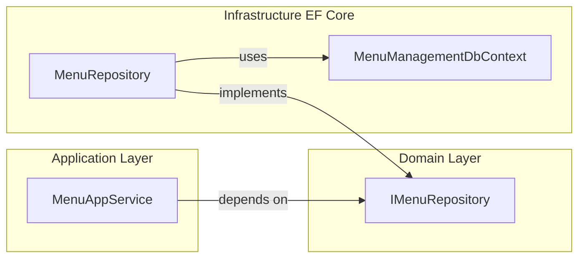

# 将 DbContext 从应用层移除并下沉到仓储层

## 分析结论

**当前问题**：在 [MenuAppService.cs](c:\work\projectsnew\menumanagement\MenuManagement.Application\Services\MenuAppService.cs) 中注入 `IDbContextProvider<MenuManagementDbContext>` 并在应用层直接使用 DbContext 操作 `MenuRoles`、`MenuOrganizations`，存在以下不合理之处：

1. **违反分层与依赖倒置**：应用层（Application）不应依赖 EF Core 或具体 DbContext，应只依赖领域层抽象（如 `IMenuRepository`）。当前写法把基础设施细节泄露到了应用层。
2. **职责错位**：对关联表“先删后增”的持久化逻辑属于数据访问职责，应放在仓储层；应用层只应编排领域与仓储调用。
3. **可测试性与可替换性差**：应用层直接依赖 DbContext 后难以用内存仓储或 Mock 替换，且与“面向接口编程”不一致。

**使用点**：DbContext 仅在以下两处被使用：

- `AssignMenusToRoleAsync`：清除该角色的现有 MenuRole，再批量插入新的 MenuRole。
- `AssignMenusToOrganizationAsync`：清除该组织的现有 MenuOrganization，再批量插入新的 MenuOrganization。

因此，将这两段“按主体替换菜单关联”的逻辑下沉到仓储中即可完全移除应用层对 DbContext 的依赖。

---

## 修改方案

### 1. 领域层：在仓储接口中新增“替换关联”能力

**文件**：[IMenuRepository.cs](c:\work\projectsnew\menumanagement\MenuManagement.Domain\Repositories\IMenuRepository.cs)

- 新增方法（不引入任何 EF 或基础设施类型）：
  - `Task ReplaceMenusForRoleAsync(Guid roleId, List<Guid> menuIds, CancellationToken cancellationToken = default);`
  - `Task ReplaceMenusForOrganizationAsync(Guid organizationId, List<Guid> menuIds, CancellationToken cancellationToken = default);`

### 2. 基础设施层：在菜单仓储实现中实现上述方法

**文件**：[MenuRepository.cs](c:\work\projectsnew\menumanagement\MenuManagement.EntityFrameworkCore\Repositories\MenuRepository.cs)

- 使用基类 `EfCoreRepository` 提供的 `GetDbContextAsync()` 获取当前 `MenuManagementDbContext`（仓储已在 EF 项目内，可访问 `MenuRoles`、`MenuOrganizations`）。
- `ReplaceMenusForRoleAsync`：查询并 `RemoveRange` 该 roleId 的现有 `MenuRoles`，再为每个 menuId 构造 `MenuRole` 并 `AddAsync`；不在此处调用 `SaveChangesAsync`，由 ABP 工作单元在请求结束时统一提交。
- `ReplaceMenusForOrganizationAsync`：同理，针对 `MenuOrganizations` 按 organizationId 做“先删后增”。

说明：ABP 的 `EfCoreRepository` 与 DbContext 在同一 UoW 内，变更会被跟踪，应用层方法仍在同一 UoW 中，因此仓储内无需显式 `SaveChangesAsync`。

### 3. 应用层：移除 DbContext 依赖并改为调用仓储

**文件**：[MenuAppService.cs](c:\work\projectsnew\menumanagement\MenuManagement.Application\Services\MenuAppService.cs)

- 从构造函数和字段中**移除** `IDbContextProvider<MenuManagement.EntityFrameworkCore.MenuManagementDbContext>` 及 `GetDbContextAsync()` 方法。
- **移除**对 `Volo.Abp.EntityFrameworkCore` 的 using（若仅被 DbContext 使用）。
- `AssignMenusToRoleAsync`：保留 `_roleRepository.GetAsync(roleId)` 校验角色存在；将原先对 DbContext 的“清除 + 批量添加”改为调用 `_menuRepository.ReplaceMenusForRoleAsync(roleId, menuIds)`。
- `AssignMenusToOrganizationAsync`：将原先对 DbContext 的操作改为调用 `_menuRepository.ReplaceMenusForOrganizationAsync(organizationId, menuIds)`。

调整后，应用层仅依赖 `IMenuRepository`、`IIdentityRoleRepository`、`IdentityUserManager`、`ICurrentUser`，不再依赖任何 EF/DbContext 类型。

---

## 架构关系（修改后）

- 应用层只依赖领域接口，不依赖 DbContext。
- DbContext 仅出现在基础设施层的 `MenuRepository` 实现中。

---

## 涉及文件汇总

| 层级                  | 文件                   | 操作                                                             |
| ------------------- | -------------------- | -------------------------------------------------------------- |
| Domain              | `IMenuRepository.cs` | 新增 2 个方法声明                                                     |
| EntityFrameworkCore | `MenuRepository.cs`  | 实现 2 个方法（内部用 GetDbContextAsync 操作 MenuRoles/MenuOrganizations） |
| Application         | `MenuAppService.cs`  | 移除 dbContextProvider 与 GetDbContextAsync；两处分配逻辑改为调用仓储新方法       |

无需修改 Controller、Contracts 或实体类；接口 `IMenuAppService` 不变，仅实现细节从“应用层用 DbContext”改为“应用层调仓储”。