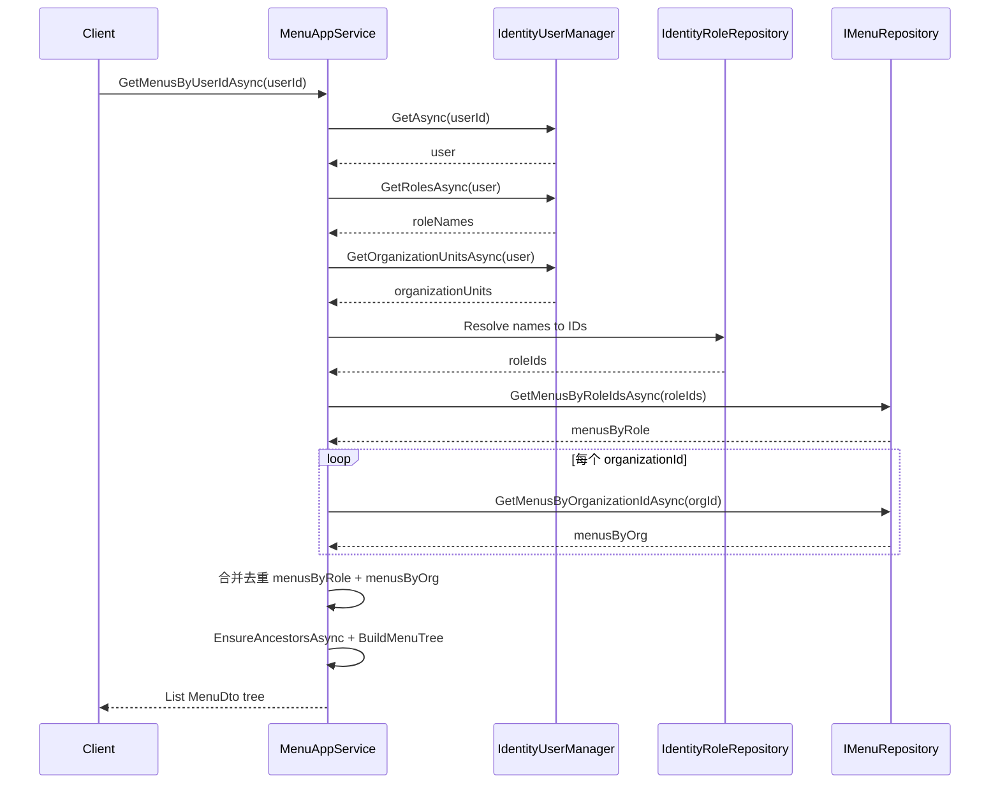

# 用户经角色获取菜单 - 分析与实现计划

## 是否需要增加角色-菜单关系（结论：不需要）

- **当前已有**：项目中已存在 **角色-菜单** 关系实体 `MenuRole`（表 `MenuRoles`），以及 **组织-菜单** 关系 `MenuOrganization`。`Menu` 实体有 `MenuRoles`、`MenuOrganizations` 导航属性，分配接口 `AssignMenusToRoleAsync` 与按角色查询 `GetMenusByRoleIdAsync` 均基于该关系实现。
- **本方案不新增任何关系**：不新增实体、不新增表。仅新增仓储**查询方法** `GetMenusByRoleIdsAsync`，该方法仍基于**现有** `MenuRole` 做“多角色 ID → 菜单”查询。
- **最佳实践**：RBAC 中“角色-菜单”是唯一权限纽带，用户通过角色间接获得菜单；不引入“用户-菜单”直接关系，避免数据冗余与权限分裂，符合业界通用做法。现有设计已满足，无需再“增加”角色-菜单关系。

## 现状分析

- **领域模型**：已有 **角色-菜单**（`MenuRole`）和 **组织-菜单**（`MenuOrganization`），没有“用户-菜单”直接关联，符合 RBAC 设计。
- **仓储层** [MenuManagement.EntityFrameworkCore/Repositories/MenuRepository.cs](c:\work\projectsnew\menumanagement\MenuManagement.EntityFrameworkCore\Repositories\MenuRepository.cs) 的 `GetMenusByUserIdAsync` 已按“用户→角色→菜单”实现：先取用户、再取 `user.Roles` 中的 `RoleId`，再按这些角色查菜单。
- **潜在问题**：`IIdentityUserRepository.GetAsync(userId)` 通常不会 Include `Roles`，导致 `user.Roles` 可能为空，从而用户永远拿不到菜单。且“用户→角色”的解析放在仓储中，职责过重、与“菜单仓储只关心菜单与角色/组织”的最佳实践不符。

## 最佳实践结论

- **权限模型**：用户不直接关联菜单；用户通过**角色**与**组织**间接获得菜单（角色菜单 ∪ 组织菜单）。
- **分层职责**：
  - **仓储**：只提供“按角色 ID 列表 / 组织 ID 查菜单”，不依赖用户或 Identity 的加载行为。
  - **应用层**：负责“解析当前主体 → 角色 ID 列表 + 组织 ID 列表 → 调用仓储分别查角色菜单与组织菜单 → 合并去重后建树/返回权限”。

这样既避免依赖 `user.Roles` 是否被 Include，又使“用户 → 角色 + 组织 → 菜单”的流程在应用层清晰可见。

## 实现方案

### 1. 仓储层：去掉“按用户”，增加“按角色 ID 列表”（仍用现有 MenuRole，不新增关系）

- **接口** [MenuManagement.Domain/Repositories/IMenuRepository.cs](c:\work\projectsnew\menumanagement\MenuManagement.Domain\Repositories\IMenuRepository.cs)：
  - 新增：`Task<List<Menu>> GetMenusByRoleIdsAsync(IEnumerable<Guid> roleIds, bool includeDetails = false, CancellationToken cancellationToken = default);`（基于**已有** MenuRole 的查询能力扩展，支持多角色一次查）。
  - 移除：`GetMenusByUserIdAsync`（不再在仓储中按用户查菜单）。
- **实现** [MenuManagement.EntityFrameworkCore/Repositories/MenuRepository.cs](c:\work\projectsnew\menumanagement\MenuManagement.EntityFrameworkCore\Repositories\MenuRepository.cs)：
  - 实现 `GetMenusByRoleIdsAsync`：沿用现有 `MenuRole` 关联，`Where(x => x.MenuRoles.Any(mr => roleIds.Contains(mr.RoleId)) && x.Status == Enabled)`，去重、排序（与现有按单角色逻辑一致，仅改为多角色）。
  - 删除 `GetMenusByUserIdAsync` 及其对 `IIdentityUserRepository` 的依赖（若仅为此用可一并移除构造函数中的 userRepository 注入）。
  - **不新增**任何实体、表或关系，仅新增一个使用现有 `MenuRole` 的查询方法。

### 2. 应用层：显式实现“用户 → 角色 + 组织 → 菜单”

- **依赖**：在 [MenuManagement.Application/Services/MenuAppService.cs](c:\work\projectsnew\menumanagement\MenuManagement.Application\Services\MenuAppService.cs) 中注入 `IdentityUserManager`（Volo.Abp.Identity），用于获取用户角色与所属组织。
- **解析用户角色 ID**（按用户场景下）：
  1. `GetAsync(userId)` 获取用户；
  2. `GetRolesAsync(user)` 获取角色**名称**列表；
  3. 用 `IIdentityRoleRepository` 按名称（或 NormalizedName）解析为角色 ID 列表（可批量查询后过滤，避免 N+1）。
- **解析用户组织 ID**（按用户场景下）：
  1. 使用同一用户实例；
  2. 调用 `IdentityUserManager.GetOrganizationUnitsAsync(user)` 获取用户所属组织单元列表（ABP Identity 组织单元 API）；
  3. 取各组织单元的 `Id` 得到 `organizationIds`。若项目未引用组织单元模块，可跳过组织维度或改用 `IUserOrganizationUnitRepository` 等可用 API。
- **GetMenusByUserIdAsync**：
  1. 按上述步骤得到该用户的 `roleIds` 与 `organizationIds`；
  2. 调用 `_menuRepository.GetMenusByRoleIdsAsync(roleIds)` 得到角色菜单列表；
  3. 对 `organizationIds` 中每个组织 ID 调用 `_menuRepository.GetMenusByOrganizationIdAsync(orgId)`，将结果与角色菜单做**并集**（按菜单 ID 去重）；
  4. 对合并后的菜单列表复用现有 `EnsureAncestorsAsync` + 树形构建逻辑并返回。
- **GetMenuPermissionsAsync(providerName "U", providerKey = userId)**：
  - 同样先解析 userId → roleIds + organizationIds，再分别查角色菜单与组织菜单、合并去重后，从菜单中抽取 `Permission` 列表并去重返回。

### 3. 数据流示意（含角色 + 组织）

### 4. 涉及文件与改动要点

| 文件                                                                                                                        | 改动                                                                                                                                                                                                                                                                                                                                                                                             |
| ------------------------------------------------------------------------------------------------------------------------- | ---------------------------------------------------------------------------------------------------------------------------------------------------------------------------------------------------------------------------------------------------------------------------------------------------------------------------------------------------------------------------------------------- |
| [IMenuRepository.cs](c:\work\projectsnew\menumanagement\MenuManagement.Domain\Repositories\IMenuRepository.cs)            | 新增 `GetMenusByRoleIdsAsync`；移除 `GetMenusByUserIdAsync`。保留 `GetMenusByRoleIdAsync` 时建议内部调用 `GetMenusByRoleIdsAsync(new[] { roleId })`。                                                                                                                                                                                                                                                          |
| [MenuRepository.cs](c:\work\projectsnew\menumanagement\MenuManagement.EntityFrameworkCore\Repositories\MenuRepository.cs) | 实现 `GetMenusByRoleIdsAsync`；移除 `GetMenusByUserIdAsync` 及对 `IIdentityUserRepository` 的依赖。                                                                                                                                                                                                                                                                                                       |
| [MenuAppService.cs](c:\work\projectsnew\menumanagement\MenuManagement.Application\Services\MenuAppService.cs)             | 注入 `IdentityUserManager`；实现“userId → roleIds”（GetRolesAsync + 角色名解析）+ “userId → organizationIds”（GetOrganizationUnitsAsync）；`GetMenusByUserIdAsync` 先取 roleIds 与 organizationIds，再调 `GetMenusByRoleIdsAsync(roleIds)` 与多次 `GetMenusByOrganizationIdAsync(orgId)`，合并去重后 `EnsureAncestorsAsync` + 建树；`GetMenuPermissionsAsync("U", ...)` 同样经 roleIds + organizationIds 分别查菜单后合并去重再抽取 Permission。 |

### 5. 小结

- **角色-菜单 / 组织-菜单关系**：无需新增；现有 `MenuRole`、`MenuOrganization` 已满足需求，本方案仅调整“按用户查菜单”的解析流程与仓储职责，不新增任何实体或表。
- **问题**：没有直接“用户-菜单”权限，且当前“按用户查菜单”藏在仓储里并依赖可能未加载的 `user.Roles`。
- **做法**：仓储只提供按角色 ID 列表与按组织 ID 查菜单；应用层用 `IdentityUserManager` 解析“用户 → 角色 ID + 组织 ID”，再分别调 `GetMenusByRoleIdsAsync` 与 `GetMenusByOrganizationIdAsync`，将**角色菜单与组织菜单并集去重**后建树/返回权限。用户可见菜单 = 角色菜单 ∪ 组织菜单，既符合“用户→角色+组织→菜单”的最佳实践，又避免未加载导航属性导致的 bug。

