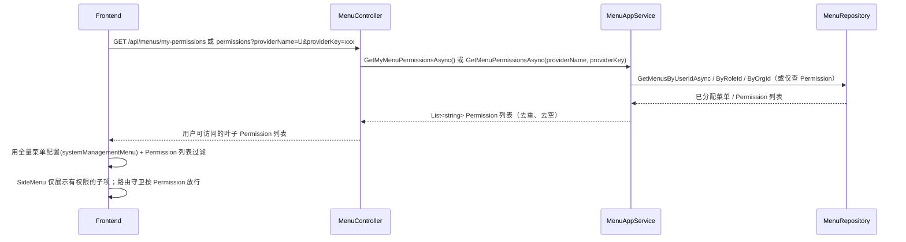

# 菜单按叶子权限过滤与后端权限完善（方案 B）

## 问题与根因

- **现象**：角色 bb 只被赋予「资源编目、数据源管理」时，登录后「资源仓库」下所有子菜单都显示。
- **根因**：菜单未按**叶子权限**过滤，而是按父级（如「系统管理」「资源仓库」）或整树展示，导致拥有父级下任一子权限时看到该父级下全部子菜单。
- **目标**：采用**方案 B**——前端保留全量菜单配置，后端提供**细粒度菜单权限列表**接口；前端在 SideMenu / 路由守卫等消费处，仅当用户权限列表包含某子菜单的 `Permission` 时才展示或允许访问该子项，实现按叶子权限过滤。

## 方案 B：全量菜单配置 + 按权限过滤

- **前端**（约定，本仓库无前端代码）：
  - 保留全量菜单配置（如 `systemManagementMenu.ts`），不改为仅渲染后端下发的树。
  - 调用新增的「菜单权限列表」接口，与 `getEntityPermissions` 对接：
    - 当前用户：`GET /api/menus/my-permissions`，或 `GET /api/menus/permissions?providerName=U&providerKey={userId}`；
    - 角色/组织：`GET /api/menus/permissions?providerName=R&providerKey={roleId}` / `providerName=O&providerKey={organizationId}`。
  - 得到当前用户的 **Permission 列表**（如 `["resource-warehouse:resource-catalog", "resource-warehouse:datasource-management"]`）。
  - 在 **SideMenu / 路由守卫**等消费处：仅当用户权限列表包含某子菜单的 `Permission`（如 `resource-catalog`、`data-source-management` 或与后端约定一致的 `resource-warehouse:resource-catalog`）时才展示或允许访问该子项。
- **后端**：提供上述菜单权限列表接口，并为叶子菜单写入稳定的 `Permission` 标识，供前端过滤与路由守卫使用。

## 架构与数据流（方案 B）

## 后端改动方案

### 1. 提供「菜单权限列表」接口（方案 B 核心）

**目的**：供前端 `getEntityPermissions` 对接，返回当前用户/角色/组织可访问的菜单 **Permission** 列表（叶子权限标识），前端据此对全量菜单配置做过滤及路由守卫。

**做法**：

- 新增接口（建议同时提供，便于前端对接）：
  - **当前用户**：`GET /api/menus/my-permissions`，返回当前登录用户通过角色/组织关联到的所有菜单的 `Permission`（去重、去空），如 `["resource-warehouse:resource-catalog", "resource-warehouse:datasource-management"]`。
  - **按主体查询**：`GET /api/menus/permissions?providerName=U|R|O&providerKey=xxx`，与前端 `getEntityPermissions("U"/"R"/"O", userId/roleId/orgId)` 对应，返回该主体可访问菜单的 `Permission` 列表。
- 实现方式：复用现有「按用户/角色/组织取菜单」逻辑，对已分配菜单做扁平化，收集所有 `Permission` 非空值并去重返回；或在仓储层新增「仅返回已分配菜单的 Permission 列表」的轻量方法以减少数据量。

**涉及文件**：

- [MenuManagement.Application.Contracts/Services/IMenuAppService.cs](c:\work\projectsnew\menumanagement\MenuManagement.Application.Contracts\Services\IMenuAppService.cs)：新增 `GetMyMenuPermissionsAsync()` 与 `GetMenuPermissionsAsync(providerName, providerKey)`。
- [MenuManagement.Application/Services/MenuAppService.cs](c:\work\projectsnew\menumanagement\MenuManagement.Application\Services\MenuAppService.cs)：实现上述方法。
- [MenuManagement.HttpApi/Controllers/MenuController.cs](c:\work\projectsnew\menumanagement\MenuManagement.HttpApi\Controllers\MenuController.cs)：新增对应 GET 端点。

**与 ABP PermissionManagement 的关系**：本接口返回的是「可访问的菜单项标识」（Menu.Permission），用于菜单展示与路由过滤；与 ABP 功能权限（如 MenuManagement.Menus.View）是两套体系。前端可将本接口作为 `getEntityPermissions` 的菜单权限数据源，专门用于菜单/路由按叶子过滤。

### 2. 为叶子菜单写入权限标识（Permission）

**现状**：[Menu](c:\work\projectsnew\menumanagement\MenuManagement.Domain\Entities\Menu.cs) 与 [MenuDto](c:\work\projectsnew\menumanagement\MenuManagement.Application.Contracts\DTOs\MenuDto.cs) 已有 `Permission` 字段；[MenuSeedDataContributor.cs](c:\work\projectsnew\menumanagement\MenuManagement.Domain\MenuSeedDataContributor.cs) 中 `CreateMenu` 未设置 `Permission`，种子数据中所有菜单的 `Permission` 为空。

**做法**：

- 在种子数据中为**叶子菜单**（具体功能/路由）设置稳定的权限标识，与前端约定一致，便于按「叶子权限」过滤和路由守卫：
  - 使用与 `Code` 一致或可读的标识，例如：`resource-warehouse:resource-catalog`、`resource-warehouse:datasource-management` 等（与现有 code 一致即可）。
- 在 [MenuSeedDataContributor.cs](c:\work\projectsnew\menumanagement\MenuManagement.Domain\MenuSeedDataContributor.cs) 的 `CreateMenu` 或各 `CreateMenu(...)` 调用处为叶子设置 `Permission = code`（目录节点可留空或与 Code 一致，以「叶子」为准做前端过滤）。

**说明**：目录节点（如「资源仓库」「系统管理」）若不需要做路由级权限校验，可仅对叶子设置 `Permission`；前端按「拥有该 Permission 才展示/可访问」即可实现按叶子过滤。Permission 与前端约定一致，例如 `resource-warehouse:resource-catalog`、`resource-warehouse:datasource-management`（与 Code 一致即可）。

### 3. 可选：按用户/角色/组织返回菜单树时补全祖先链

若其他场景（如管理端分配菜单、或部分页面仍使用「按用户取树」接口）需要返回完整可展示的树，可在 Application 层对「按角色/用户/组织获取的菜单」补全祖先链后再 BuildMenuTree，避免仅分配叶子时返回空树。方案 B 下前端主要依赖「菜单权限列表」接口 + 全量配置过滤，本项为可选增强。

## 前端对接约定（方案 B，本仓库无前端代码）

- 前端保留**全量菜单配置**（如 `systemManagementMenu.ts`），不改为仅渲染后端下发的树。
- 调用**菜单权限列表**接口（与 `getEntityPermissions` 对接）：`GET /api/menus/my-permissions` 或 `GET /api/menus/permissions?providerName=U&providerKey=xxx`，得到当前用户的 Permission 列表。
- 在 **SideMenu / 路由守卫**等消费处：仅当用户权限列表包含某子菜单的 `Permission`（如 `resource-warehouse:resource-catalog`、`resource-warehouse:datasource-management`）时才展示或允许访问该子项，实现按叶子权限过滤。

## 实施顺序建议

1. **叶子菜单 Permission**：在 [MenuSeedDataContributor.cs](c:\work\projectsnew\menumanagement\MenuManagement.Domain\MenuSeedDataContributor.cs) 中为叶子菜单设置 `Permission`（与 Code 一致）；已有数据可考虑迁移或重新 Seed。
2. **菜单权限列表接口**：实现 `GetMyMenuPermissionsAsync`、`GetMenuPermissionsAsync(providerName, providerKey)` 及对应 GET 端点，供前端按叶子权限过滤与路由守卫使用。
3. **可选**：菜单树接口补全祖先链，供其他使用「按用户/角色取树」的场景得到完整树结构。

按上述顺序完成后，后端即可支撑方案 B；前端按约定对接权限列表接口并在 SideMenu/路由守卫处按 Permission 过滤即可复现预期行为。